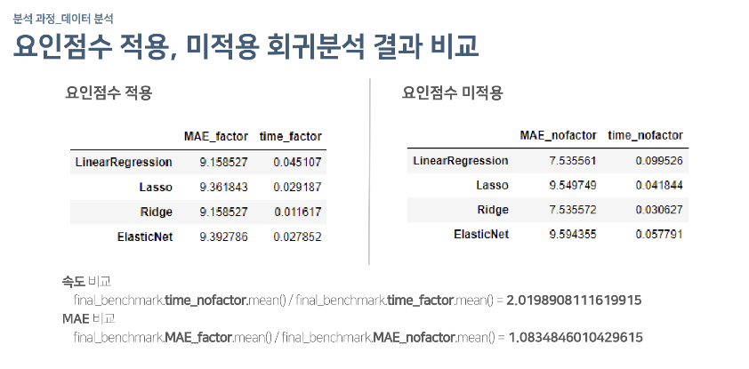

# 교통량 예측과 요인분석

|기간|Tags|역할|
|:---:|:---:|:---:|
|2022.11.18 ~ 2022.11.24|EDA, Factor Analysis, ML|팀장, Factor Analysis, Modeling|

## 프로젝트 요약
- 제주도 도로교통량의 여러 feature들을 요인분석해 유의미안 요인 도출 및 해석과 해당 요인을 변수로 활용했을 때 모델 성능 및 효율성 비교를 진행했다.

- 요인분석 결과 두 개의 요인이 나왔고 factor loading 값이 큰 feature는 다음과 같다.
    1. factor1 : 통과제한하중, 도로유형 
    2. 차로수, 속도제한, 시작/도착지점 회전제한 유무
    
- 따라서 fator1은 "간접적 요인", factor2는 "직접적 요인"이라고 명명했다.
- 이 요인들을 변수로 활용했을 때의 벤치마킹은 아래와 같다.

