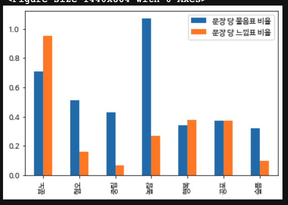

# 연애상담챗봇 학습을 위한 데이터 분석

|기간|Tags|역할|
|:---:|:---:|:---:|
|2022.05.29 ~ 2022.06.06|Konlp, TF-IDF, Data Visualization|개인참여|
## 프로젝트 요약
- 본 프로젝트는 연애(이별, 사랑)와 7가지 감정에 대한 형태소들의 빈도 분석을 통해 상대의 의도파악과 감정분류를 할 수 있는 챗봇을 위한 사전 데이터 분석을 진행했다.  

- 본 프로젝트는 의도(사랑, 이별)와 감정(분노', '혐오', '중립', '놀람', '행복', '공포', '슬픔')에 따른 형태소의 구성을 분석한다.
- 여기서 냈던 아이디어는 각 감정에 따라 텍스트에 쓰인 물음표와 느낌표의 구성에 차이가 있을 것이고 그것을 밝히자는 것이었다.

- 비교 결과 위 그림처럼 “놀람” 클래스에 있어서 물음표의 비율이 압도적으로 높은 것으로 확인되었다.
- 이는 놀람이라는 감정을 느낌표를 통해 표현하는 경우가 많다고 해석된다. 또한 느낌표와 물음표 모두 “분노” 클래스에서 sentence 당 높은 비율로 사용되는 것이 확인되었다.
