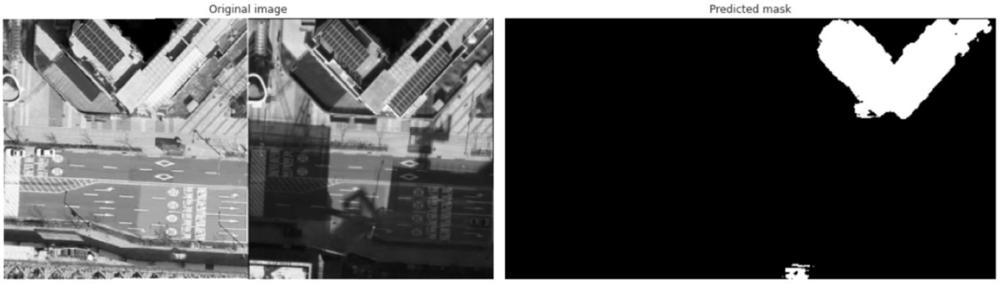

# 항공이미지활용 건물변화탐지

|기간|Tags|역할|
|:---:|:---:|:---:|
|2022.10.15 ~ 2022.11.07|CV, Sementic Segmentation|선행연구조사, MMsegmentation|

## 프로젝트 요약
- 일정 기간 전 후의 특정 좌표 항공이미지를 비교해 건물의 변화 탐지를 한다. pytorch_segmentation과 MMsegmentation을 활용했다.

- 건물변화 탐지를 위한 input image는 위와 같다.
- 데이터를 받기 전 task 이름만으로 building change detection이란 detection분야에 대한 선행연구 조사를 실시했다.
- 하지만 위 사진처럼 전 후 사진이 가로로 붙어있는 형태에서 Sementic Segmentation을 활용해 픽셀 단위의 분류를 진행해야했다.
- 이를 위해 오픈소스 라이브러리인 pytorch_segmentation과 MMsegmentatoin을 활용했다.
- 이 중 pytorch_segmentation에서 DeepLabV3plus -  ResNet50 Encoder가 가장 성능이 높았고, MMsegmentation은 계속된 오류로 사용하지 못했다.
- 본 프로젝트를 통해 질 높은 오픈 소스 라이브러리를 잘 다룰 줄도 알아야된다고 느꼈다.
