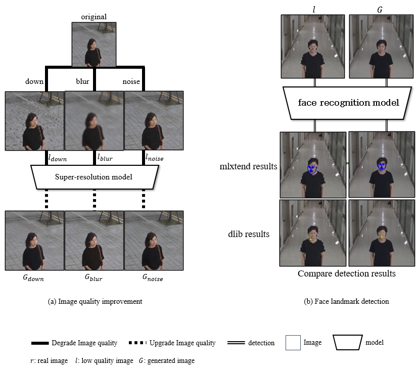

# 안면 이미지 초해상화와 특징점 검출
- 본 프로젝트는 국민대학교 AI빅데이터융합경영학과 캡스톤디자인 수업에서 진행되었다.

|기간|Tags|역할|
|:---:|:---:|:---:|
|2022.09.25 ~ Present|CV, Super-resolution, Landmark detection|팀장, 1저자|

## 프로젝트 프로세스
1. main key 선행연구조사
2. task 제안
3. task관련 선행연구조사
4. task 확정
5. 데이터셋 구축
6. 모델 학습
7. 논문 작성

## 얻을 수 있었던 경험
1. 영어 논문을 포함한 선행연구조사 과정
2. 필요한 데이터셋 커스텀
3. 딥러닝 환경 구축
4. 필요한 모델 서칭
5. 딥러닝 모델 학습
6. 논문 작성

## 프로젝트 요약
  - 본 프로젝트는 강의를 통해 main key에 대한 기초적인 학습을 한 후, 학생들의 자체적인 선행연구조사부터 딥러닝 모델 output 추출과 논문 작성까지 하는 end-to-end 프로젝트였습니다. 강의의 main key는 “detection”이었으며, 우리 팀은 다양한 환경에서의 안면 이미지에 대해 초해상화를 시킨 전후 그룹에 대한 특징점 검출 실험을 task로 정했다.
  - 데이터셋은 AIHUB의 < 한국인 마스크 착용 얼굴 이미지 > 중 일부를 선정해 전처리 후 사용했다. 초해상화 모델로는 현재 안면 이미지 초해상화 SOTA 모델인 HifaceGAN을 사용해 downsampling, blur, noise 세 가지 화질 저하 요인에 대해 화질을 개선했다. 화질 개선 전 후 그룹에 대해 mlxtend, dlib이라는 오픈 소스 라이브러리를 사용해 특징점 검출을 진행했고, 화질 개선 후 그룹에서 검출 성능이 향상됨을 확인했다. 전체 흐름은 아래 그림과 같다.

