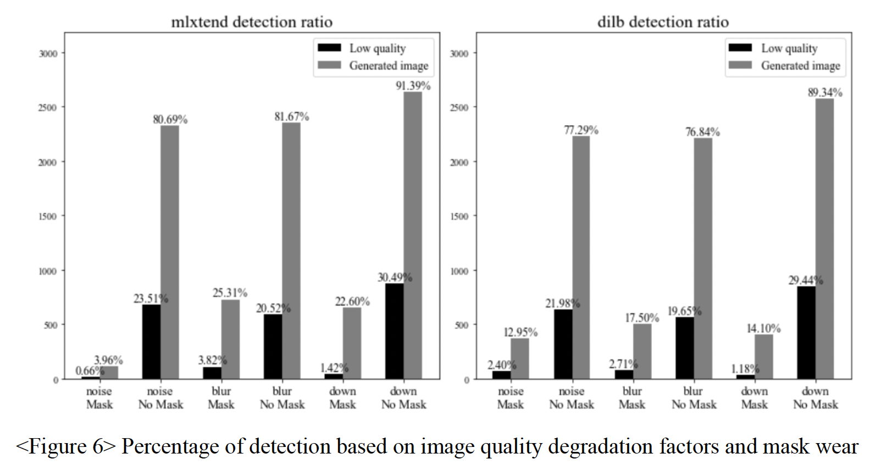
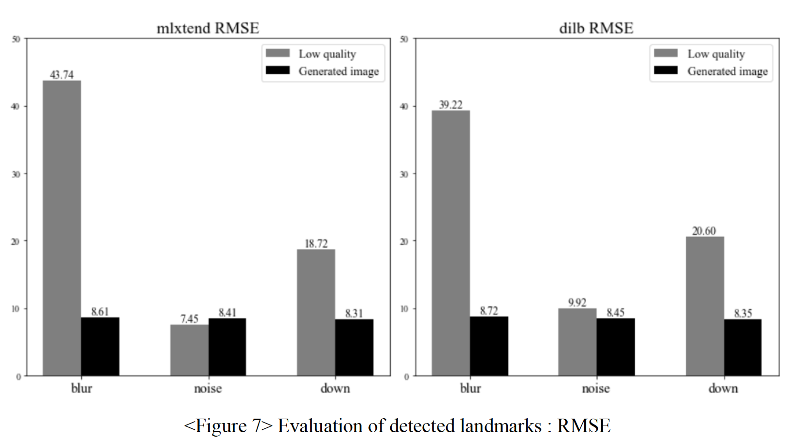

# 안면 이미지 초해상화와 특징점 검출
- 본 프로젝트는 국민대학교 AI빅데이터융합경영학과 캡스톤디자인 수업에서 진행되었다.

|기간|Tags|역할|
|:---:|:---:|:---:|
|2022.09.25 ~ Present|CV, Super-resolution, Landmark detection|팀장, 1저자|

## 프로젝트 프로세스
1. main key 선행연구조사
2. task 제안
3. task관련 선행연구조사
4. task 확정
5. 데이터셋 구축
6. 모델 학습
7. 논문 작성

## 얻을 수 있었던 경험
1. 영어 논문을 포함한 선행연구조사 과정
2. 필요한 데이터셋 커스텀
3. 딥러닝 환경 구축
4. 필요한 모델 서칭
5. 딥러닝 모델 학습
6. 논문 작성

## 프로젝트 요약
  - 본 프로젝트는 강의를 통해 main key에 대한 기초적인 학습을 한 후, 학생들의 자체적인 선행연구조사부터 딥러닝 모델 output 추출과 논문 작성까지 하는 end-to-end 프로젝트였다. 강의의 main key는 “detection”이었으며, 우리 팀은 다양한 환경에서의 안면 이미지에 대해 초해상화를 시킨 전후 그룹에 대한 특징점 검출 실험을 task로 정했다.
  - 데이터셋은 AIHUB의 < 한국인 마스크 착용 얼굴 이미지 > 중 일부를 선정해 전처리 후 사용했다. 초해상화 모델로는 현재 안면 이미지 초해상화 SOTA 모델인 HifaceGAN을 사용해 downsampling, blur, noise 세 가지 화질 저하 요인에 대해 화질을 개선했다. 화질 개선 전 후 그룹에 대해 mlxtend, dlib이라는 오픈 소스 라이브러리를 사용해 특징점 검출을 진행했고, 화질 개선 후 그룹에서 검출 성능이 향상됨을 확인했다. 전체 흐름은 아래 그림과 같다.

## 실험 결과
### 1. 이미지에서의 특징점 검출 비율

  - 68개 안면 특징점 검출에는 오픈 소스 라이브러리인 mlxtend와 dlib의 face 68landmark detection 모델을 사용하고, 검출된 특징점을 평가한다. 안면 특징점 검출의 평가지표로는 일반적으로 NME(Normalized Mean Error)가 사용된다. 이는 이미지 상에서 안면이 차지하는 비율이 데이터마다 상이해 특징점의 좌표값 범위 또한 다르기 때문에 값의 정규화를 통해 표준화시킨 평가지표이다. 일반적으로 정규화 상수로는 두 눈 사이의 거리가 사용된다. 하지만 본 실험에 쓰인 이미지들은 이미 두 눈 사이의 거리를 통해 전처리를 거쳐 정규화를 할 필요가 없기 때문에 RMSE(Root Mean Square Error)를 사용했다. 또한 특징점이 검출되지 않은 경우, 모델의 출력값이 음수와 같이 이미지의 크기에서 벗어나는 좌표값을 갖고 있어 이를 그대로 평가지표에 반영하면 되지만, mlxtend와 dlib의 특징점 검출 모델은 오픈 소스 라이브러리의 모델이기 때문에 검출이 안된 경우 이 출력값을 알지 못한다. 따라서 본 실험에서는 각 모델별로 특징점을 검출해낸 비율과, 검출해낸 경우에 한해서 RMSE를 계산한다.
  - 각 모델과 화질 저하 요인, 화질 개선 여부 별 특징점 검출 비율은 아래와 같다.    
  

  - 특징점 검출이 된 이미지에 한해서 측정한 RMSE는 아래와 같다.     
  

